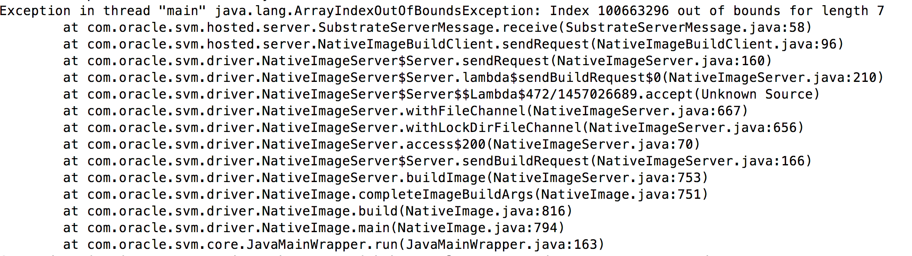

# graalVM环境试用clojure

## graalVM简介
graalVM是Oracle推出的一个全栈虚拟机。声称无缝支持多语言，零开销多语言互调；可以将代码编译为Native的二进制镜像、具有很高的启动速度。

* 官网 [https://www.graalvm.org/](https://www.graalvm.org/)
* 有企业版和社区版 ，支持linux和mac OS X ，最新版本为 1.0.0-RC7 。
* 官方首页的介绍，核心特性有三点：Polyglot、Native、Embeddable。


## Leiningen可用性
* graalvm 1.0.0 在jdk1.8基础上开发，其目录结构相似，仍然包含jre的部分。

  graalvm目录 | jdk1.8目录
  ----|----
   | 

* 在idea中创建 Leiningen 工程时指定JDK为graalvm的路径即可。使用 graalvm 的 Leiningen 对工程的组织构建在使用上与jdk1.8并无明显差别。

 
 
* 使用Leiningen插件 [lein-native-image](https://github.com/taylorwood/lein-native-image) ,可以支持使用命令 `lein native-image` 将工程代码编译为二进制镜像。
  * 
  * 
  * 设置上与jvm下的工程略有不同，graalvm下必须指定唯一的程序入口（:main 选项），而jvm可以不用指定，在程序启动时再指定，如：
  
   ```
    java -cp target/account-demo-1.0.0-SNAPSHOT-standalone.jar \
    clojure.main -e "(use 'account.main)(-main)" 
   ```

## REPL可用性

工程使用 graalvm 作为 jdk 环境，REPL可以正常运行，使用上与jdk1.8相当。

## 生成本地文件

考虑我们实际应用场景，尝试我们最核心的服务：web服务和数据库。测试的情况不乐观，clojure环境是能工作，自己写的代码也许工作良好，但依赖的各种库是否能工作就难以保障。比如我们常用的数据库datomic，就无法编译通过。

### web服务
web服务，常用的用ring（基于jetty）、aleph（基于netty）、http-kit。

##### 使用 ring（版本1.6.3）提供 web 服务。
* 编译很顺利，运行就挂了。ring中使用的反射在编译为二进制后失效了。


* [参考代码工程](examples/ring)

##### 使用 http-kit (版本2.3.0) 提供web服务。
  * 编译很顺利，运行正常。
  * 这个工程同样依赖了ring，但只用了其中的中间件，没有使用ring来提供web服务。
  * [参考代码工程](examples/http-kit)。这个工程代码是 lein-native-image 插件的示例工程 [https://github.com/taylorwood/lein-native-image/tree/master/examples/http-api](https://github.com/taylorwood/lein-native-image/tree/master/examples/http-api).

### datomic数据库

clojure生态圈使用最多的datomic数据库，也是我们公司使用的主要数据库。应用服务需要依赖datomic的客户端，引入一个依赖库。

* 引入这个库后，在编译过程就失败，似乎陷入了死循环或者编译这个数据库的复杂度超越了当前版本graalvm的能力范围。


* 依赖库中使用了datomic (版本free 0.9.5656)，编译时CPU火力全开跑了几十分钟后（四核八线程的Intel四代标压移动i7处理器），抛出异常，挂了。


* [参考代码工程](examples/account_demo)

## 性能对比
* 启动时间对比(使用mac上time命令计时,examples/http-kit工程)

  jvm + aot | graalvm image
  -----|----
  real 0m2.609s | real	0m0.028s 
  user 0m8.327s | user 0m0.010s
  sys 0m0.389s | sys 0m0.012s

  
* http请求(100次，前端控制串行执行，使用mac上time命令计时)

  jvm + aot | graalvm image
  ----|----|
  real 0m2.153s | real 0m1.967s 
  user 0m0.895s | user 0m0.901s 
  sys  0m0.512s | sys 0m0.506s 
  
## 大小对比

使用examples/http-kit工程，分别使用jvm的aot和graalvm编译做对比：

* 使用graalvm编译出的二进制镜像大小为34495212B.（34MB）
* 使用jvm aot打出的standalone的uberjar的大小为23056195B。(23MB)

## 跨平台运行能力
* graalvm当前只有mac和linux版本，还没有windows版本。
* graalvm编译出的二进制镜像，并不能跨平台运行，比如mac上编译出来的，在linux上不能运行。

## docker化
docker化方法参考了这篇文章[https://www.innoq.com/en/blog/native-clojure-and-graalvm/](https://www.innoq.com/en/blog/native-clojure-and-graalvm/)。这篇文章中将一个简单的java文件编译打包成docker镜像，大小仅10M，作为对比，使用jre的镜像在70M以上。docker化的步骤为：

* 首先要做个带Leiningen、graalvm环境的基础镜像。（mac上编译的在linux内核的docker容器里跑不转）。这个docker镜像有1.1G大小。
  * [Dockerfile](docker/base/graalvm/Dockerfile)
  * 

* 然后在这个基础镜像中编译代码成二进制文件，再打包成docker镜像，打包时除了必要的库文件，就不用再拖着Leiningen和graalvm了。
  * [Dockerfile](docker/Dockerfile)
  
* 尝试使用http-kit工程，打出的docker镜像大小为96MB! 用 jvm + oat 也差不多大小啊。
   

（事情还没完，这个环境，http-kit工程，用graalvm编译成功二进制镜像打出来了，docker镜像打出来了，也都可以启动了，web服务起来了。但是，运行过程中，外部请求http接口，又出错啦，抛了个`munmap_chunk(): invalid pointer`直接挂了。Google之，曰同一块内存被释放两次。。。但是，同样工程在docker外的Leiningen、graalvm环境就工作正常，开发与打包不一致。。。）

## 与其他语言的交互

graalvm 中使用 polyglot 来进行语言间的调用，包括传递数据结构。目前支持被调用的语言包括 js、python、R、ruby、llvm ，这些语言间是可以互相调用的。（graalvm的设计里有一条：各语言是平等的，弱化主语言的概念。但是polyglot里却不能从其他语言调java! ）


这些语言里头暂时还没有clojure。不过由于clojure可以无缝调用java,所以想从clojure里调其他语言还是跟java里调其他语言没什么区别的，但要从其他语言调clojure，再等等吧。

clojure里通过java再调其他语言的处理，可以参考这篇文章：
[http://gigasquidsoftware.com/blog/2017/10/22/embedded-interop-between-clojure-r-and-python-with-graalvm/](http://gigasquidsoftware.com/blog/2017/10/22/embedded-interop-between-clojure-r-and-python-with-graalvm/)


